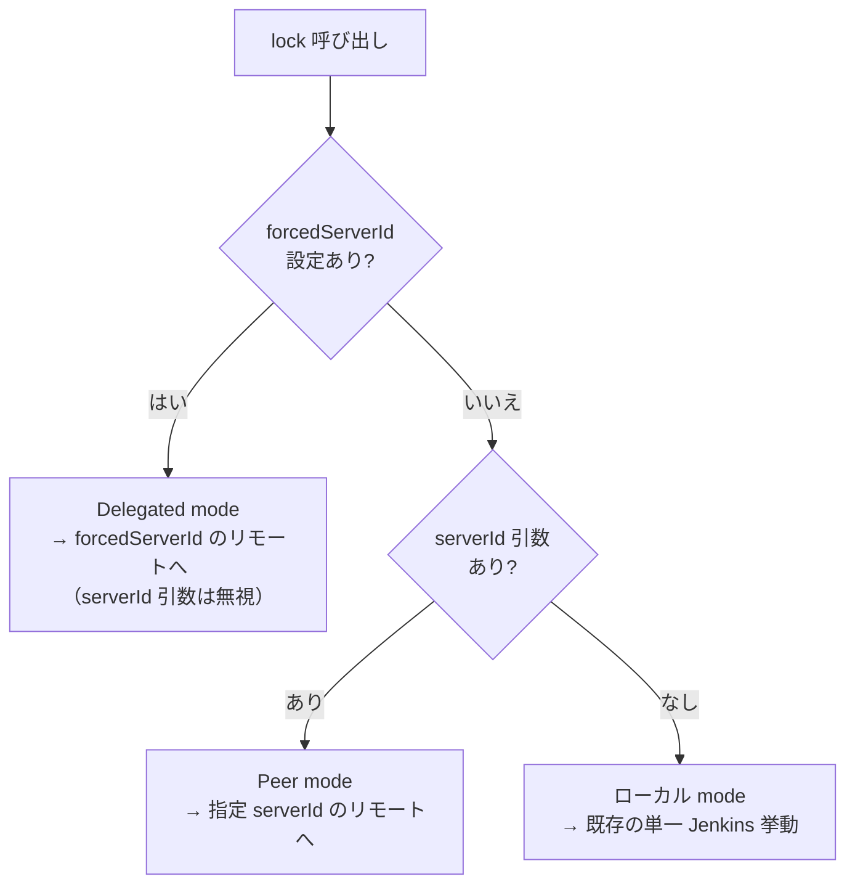
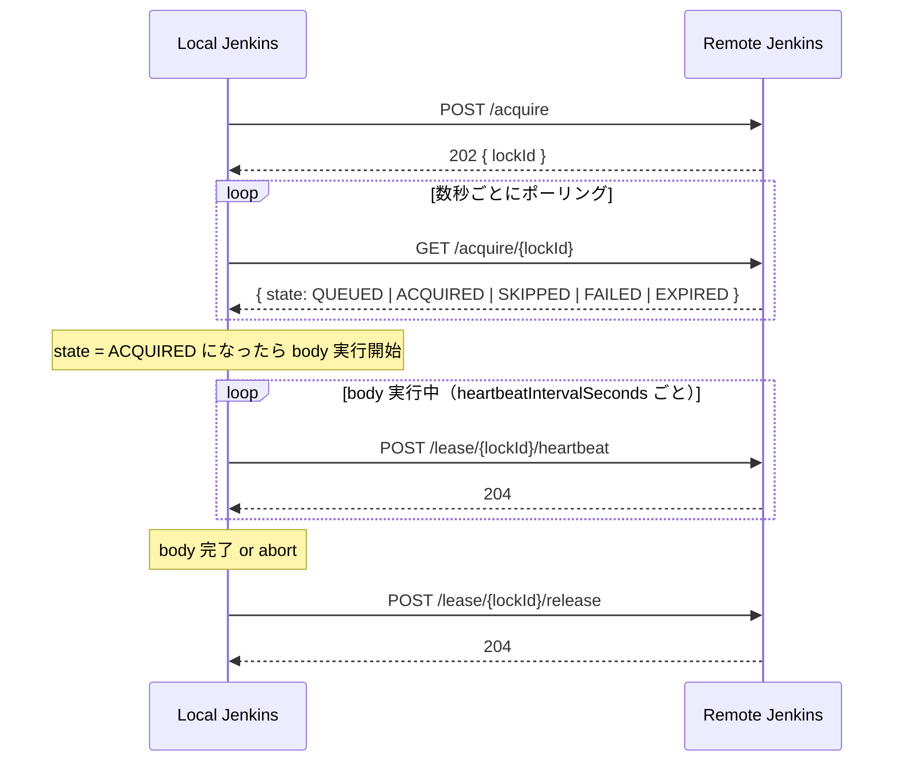
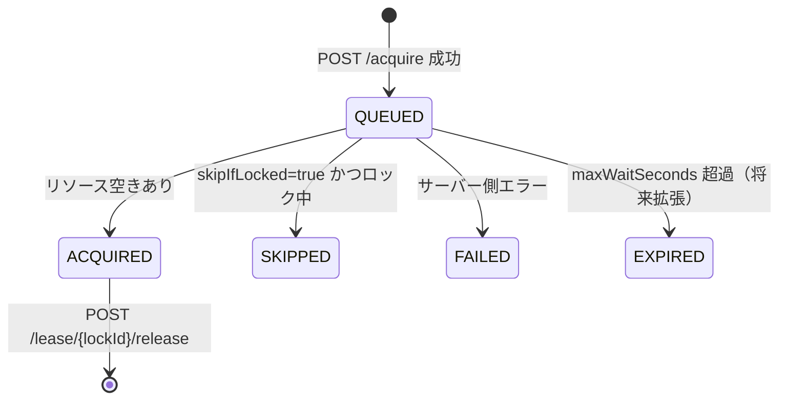
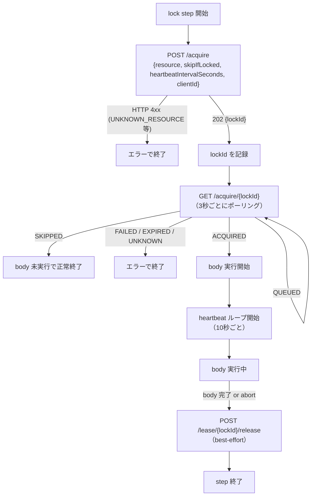
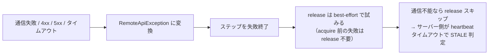

# Remote Lockable Resources 仕様書（Phase 1 / M1）

> **出典:** [jenkinsci/lockable-resources-plugin #1025](https://github.com/jenkinsci/lockable-resources-plugin/issues/1025)
> **設計変更反映:** `cancel` エンドポイント廃止、`requestId`/`leaseId` を `lockId` に統一
> **対象スコープ:** Phase 1 M1（peer mode の最小成立）

---

## 目次

1. [概要・目標](#1-概要目標)
2. [動作モード](#2-動作モード)
3. [DSL 解決ルール](#3-dsl-解決ルール)
4. [REST API 仕様](#4-rest-api-仕様)
5. [クライアントループ](#5-クライアントループ)
6. [設定サーフェス](#6-設定サーフェス)
7. [ハートビートと STALE 判定](#7-ハートビートと-stale-判定)
8. [エラー方針（fail-closed）](#8-エラー方針fail-closed)
9. [スコープ整理（Phase 1 M1 の含む/含まない）](#9-スコープ整理phase-1-m1-の含む含まない)

---

## 1. 概要・目標

### 一言で言うと

`lock(resource: 'X', serverId: 'B')` と書くだけで、**別 Jenkins が管理するリソース**をロックできる。

### 設計上の制約

- `{ body }` は **常にローカル Jenkins 上** で実行される。
- リモート Jenkins がリソースの **single source of truth**。
- 通信方向は **local → remote のみ**（リモートから折り返し接続しない）。
- 通信失敗は **fail-closed**（ロックを自動解放しない）。
- リモートのリソースは **事前に登録済みであること**（API 経由の動的作成は不可）。

### ゴール

| ゴール | 詳細 |
|---|---|
| peer mode | `lock(..., serverId: 'X')` で明示指定 |
| delegated mode | `forcedServerId` 設定時に透過的にルーティング |
| 後方互換 | `serverId` 未指定 かつ `forcedServerId` 未設定 → 既存挙動そのまま |
| 認証 | username/password credential（service account + API token） |
| スケール想定 | 小〜中規模。数秒のポーリング遅延は許容 |

---

## 2. 動作モード



### Peer mode（M1 対象）

- パイプライン側が `serverId: 'X'` を明示指定する。
- どのリモートへアクセスするか、パイプラインが把握している。
- デバッグや運用上のオーバーライドにも使える。

### Delegated mode（M2 以降）

- ローカル Jenkins に `forcedServerId` を設定するだけ。
- パイプライン側のコード変更なしに全ロックをリモートへ委譲できる。
- 委譲中はローカルのリソース定義は使われない（名前衝突リスクを排除）。

---

## 3. DSL 解決ルール

```
if forcedServerId が設定されている場合:
    target = (forcedServerId, resource名)
    # serverId 引数があっても無視（build log に INFO 出力）

else if lock(..., serverId: 'X') が指定された場合:
    target = (X, resource名)          # peer mode

else:
    target = (LOCAL, resource名)      # 既存挙動
```

**Delegated mode の注意点:**
- ローカルのリソース定義は一切参照されない。
- 名前不一致は即時 `UNKNOWN_RESOURCE` で失敗（「ローカルにあると思ったら実はリモート」という事故を防ぐ）。

---

## 4. REST API 仕様

### ベースパス

```
/lockable-resources/remote/v1/
```

`remoteApiEnabled = false`（デフォルト）の場合、全エンドポイントが 403 を返す。

> **設計判断:** Remote LR 機能は将来的に LR プラグイン標準機能となる想定のため、
> エンドポイントの存在を秘匿する必要はない。
> 無効状態であることを明示する 403 Forbidden を採用する。

---

### 識別子の統一（設計変更）

> **設計変更点（issues/1025 からの変更）:**
> 元の仕様では acquire フェーズの `requestId` と lease フェーズの `leaseId` が別々だったが、
> **`lockId` として統一**した。
> `POST /acquire` が返した `lockId` を、ポーリング・heartbeat・release のすべてで使い回す。

---

### エンドポイント一覧



---

### `POST /acquire`

**目的:** acquire リクエストをキューに登録する。

**リクエストボディ:**

```jsonc
{
  "resource": "board-a1",          // 対象リソース名（必須）
  "skipIfLocked": false,           // ロック中ならスキップするか（任意、デフォルト false）
  "heartbeatIntervalSeconds": 10,  // クライアント側 heartbeat 間隔（任意）
  "clientId": "https://jenkins-a.example.com/" // 呼び出し元 Jenkins の識別子（任意）
}
```

> `clientId` は任意フィールド。省略時はサーバー側で `(Undefined)` として扱う。
> Phase 1 ではクライアント側設定の `clientId`（未設定時は `Jenkins.getRootUrl()`）を自動送信する。

**レスポンス:**

| HTTP | 意味 |
|---|---|
| `202 Accepted` | キュー登録成功。`{ "lockId": "..." }` を返す |
| `400 Bad Request` | `INVALID_HEARTBEAT_INTERVAL` など入力不正 |
| `404 Not Found` | `UNKNOWN_RESOURCE` — リソースが存在しないか公開されていない |

> 取得成否は **このレスポンスには含まれない**。必ず `GET /acquire/{lockId}` でポーリングして確認する。

---

### `GET /acquire/{lockId}`

**目的:** acquire リクエストの現在状態を返す（ポーリング用）。

**レスポンスボディ:**

```jsonc
{
  "lockId": "...",
  "state": "QUEUED",     // 下表参照
  "errorCode": null,     // 失敗時のエラーコード
  "message": null        // 人向けの補足メッセージ
}
```

**state 一覧:**



| state | 意味 | クライアントの対応 |
|---|---|---|
| `QUEUED` | 待機中 | ポーリング継続 |
| `ACQUIRED` | ロック取得済み | body 実行開始、heartbeat 開始 |
| `SKIPPED` | skipIfLocked でスキップ | body 未実行で正常終了 |
| `FAILED` | サーバー側エラー | エラーで終了 |
| `EXPIRED` | タイムアウト（将来拡張） | エラーで終了 |
| `UNKNOWN` | 解釈不能な応答 | fail-closed で終了 |

> **`CANCELLED` について（設計変更）:**
> 元の仕様では `POST /acquire/{requestId}/cancel` によりクライアント側から明示キャンセルできたが、
> **Phase 1 では cancel エンドポイントを廃止**した。
> abort・正常完了いずれも `POST /lease/{lockId}/release` に統合。
> サーバー側・管理者操作による `CANCELLED` 状態は互換性のため受け取れるが、クライアントからは発行しない。

---

### `POST /lease/{lockId}/heartbeat`

**目的:** body 実行中の死活確認シグナルを送る。

- body 実行中のみ送信する（ポーリング中は送らない）。
- 間隔は `heartbeatIntervalSeconds`（Phase 1 では内部定数 10s）。

**レスポンス:** `204 No Content`

---

### `POST /lease/{lockId}/release`

**目的:** リースを解放する。

- body 完了時に呼ぶ。
- abort（中断）時も best-effort で呼ぶ。
- **fail-closed**: 通信失敗時はサーバー側が heartbeat タイムアウトで STALE 判定する。

**レスポンス:** `204 No Content`

---

### `GET /resources`（M3 以降）

**目的:** このリモート Jenkins が公開しているリソース一覧を返す。

- 状態（ロック中か否か）は含まない（安価にキャッシュできるよう）。
- クライアント側 LR ページのリモートビューに使用。

---

## 5. クライアントループ



**実装上のポイント:**

| 項目 | 値（Phase 1 内部定数） |
|---|---|
| ポーリング間隔 | 3 秒 |
| heartbeat 間隔 | 10 秒 |
| リクエストタイムアウト | 10 秒 |

---

## 6. 設定サーフェス

### サーバー側（リソースを公開する Jenkins）

| 設定 | デフォルト | 説明 |
|---|---|---|
| `remoteApiEnabled` | `false` | マスタースイッチ。`false` の間は全エンドポイントが 403 を返す |
| `exposeLabel` | 未設定 | このラベルを持つリソースのみ公開。**未設定時は何も公開しない**（opt-in） |

### クライアント側（リモートロックを起動する Jenkins）

| 設定 | 説明 |
|---|---|
| `clientId` | リモートサーバーに送る自己識別子。空白時は `Jenkins.getRootUrl()` を使用。サーバー側 LR ページで "Locked by remote: `clientId`" として表示される |
| `remotes[]` | サーバー接続のマップ（キー = `serverId`） |
| `remotes[].url` | リモート Jenkins のベース URL |
| `remotes[].credentialsId` | Jenkins Credentials ID（username/password 型。username = サービスアカウント、password = API トークン） |
| `forcedServerId` | 設定時は Delegated mode。`remotes` のキーと一致する必要がある |

> `serverId` はクライアント側が付けたエイリアスであり、リモート Jenkins は認識しない。

### バリデーション

- `forcedServerId` が設定されている場合、`remotes` のキーに存在しないと保存時にエラー。
- `serverId` の前後スペースは自動トリム（警告ログあり）。

---

## 7. ハートビートと STALE 判定

### クライアントが heartbeatIntervalSeconds をワイヤーで送る理由

Phase 1 では `heartbeatIntervalSeconds` はユーザー設定不可の内部定数だが、将来の設定化に備えて **API リクエスト上には既に含めている**。これにより、設定化時に API バージョンを上げる必要がなくなる。

### サーバー側の STALE しきい値（Phase 1 ハードコード）

```
staleThresholdSeconds = max(heartbeatIntervalSeconds × 6, 60)
```

- STALE になっても **自動解放はしない**（状態が STALE になるだけ）。
- `GET /lease/{lockId}` のレスポンスに `heartbeatIntervalSeconds` と `staleThresholdSeconds` が含まれ、設定値を確認できる。

---

## 8. エラー方針（fail-closed）



**設計方針:**

- 通信失敗時にロックを自動解放しない（fail-closed）。
- `ACQUIRED` 後の失敗は best-effort で `release` を試みる。
- 認証情報はログに出力しない（`serverId / method / path / status` のみ）。

---

## 9. スコープ整理（Phase 1 M1 の含む/含まない）

### 含む（M1）

| 項目 | 内容 |
|---|---|
| DSL | `lock(..., serverId: 'X')` による peer mode |
| クライアント実装 | `RemoteApiClient`（acquire/poll/heartbeat/release） |
| サーバー REST API | `POST /acquire`, `GET /acquire/{lockId}`, `POST /lease/{lockId}/heartbeat`, `POST /lease/{lockId}/release` |
| 設定モデル | `RemoteConnection`（serverId/url/credentialsId）、`LockableResourcesManager.remotes` |
| エラー処理 | fail-closed、`RemoteApiException` |

### 含まない（M1 スコープ外）

| 項目 | 備考 |
|---|---|
| `forcedServerId`（Delegated mode） | M2 |
| `GET /resources` とクライアント側 LR ページのリモートビュー | M3 |
| `POST /acquire/{lockId}/cancel` | **廃止**（release に統合） |
| 認証（credentialsId の実際の解決） | Phase 1 では未実装、警告ログのみ |
| ユーザー設定可能なポーリング/heartbeat/タイムアウト値 | Phase 2 |
| 複数リモートへのフェイルオーバー | Phase 3 |
| `serverId: 'any'` 自動選択 | Phase 3 |
| フリースタイルプロジェクトサポート | Phase 3 以降 |
| `GET /lease/{lockId}`（診断エンドポイント） | M1 後の拡張候補 |
