# Lockable Resources Plugin Architectural Analysis

Target branch: master  
Target path: `lockable-resources-plugin/`  
Purpose: to document implementation details and provide study material for future extension design.

---

## Table of Contents

1. [High-Level Architectural Overview](#1-high-level-architectural-overview)
2. [Package Structure and Class Responsibilities](#2-package-structure-and-class-responsibilities)
3. [Data Model Details](#3-data-model-details)
4. [Execution Flow of the Pipeline lock Step](#4-execution-flow-of-the-pipeline-lock-step)
5. [How the Waiting Queue Works](#5-how-the-waiting-queue-works)
6. [Integration with Freestyle Builds](#6-integration-with-freestyle-builds)
7. [UI and HTTP API](#7-ui-and-http-api)
8. [Persistence Mechanism](#8-persistence-mechanism)
9. [Nodes Mirror Feature](#9-nodes-mirror-feature)
10. [Synchronization and Thread-Safety Strategy](#10-synchronization-and-thread-safety-strategy)

---

## 1. High-Level Architectural Overview

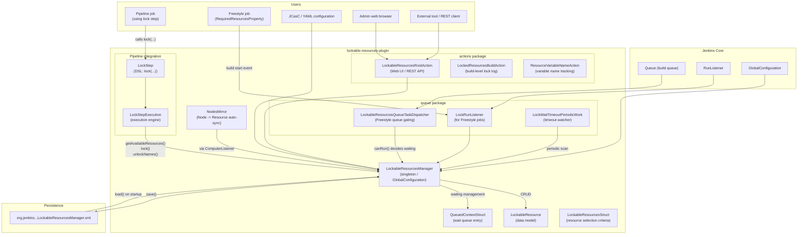

---

## 2. Package Structure and Class Responsibilities

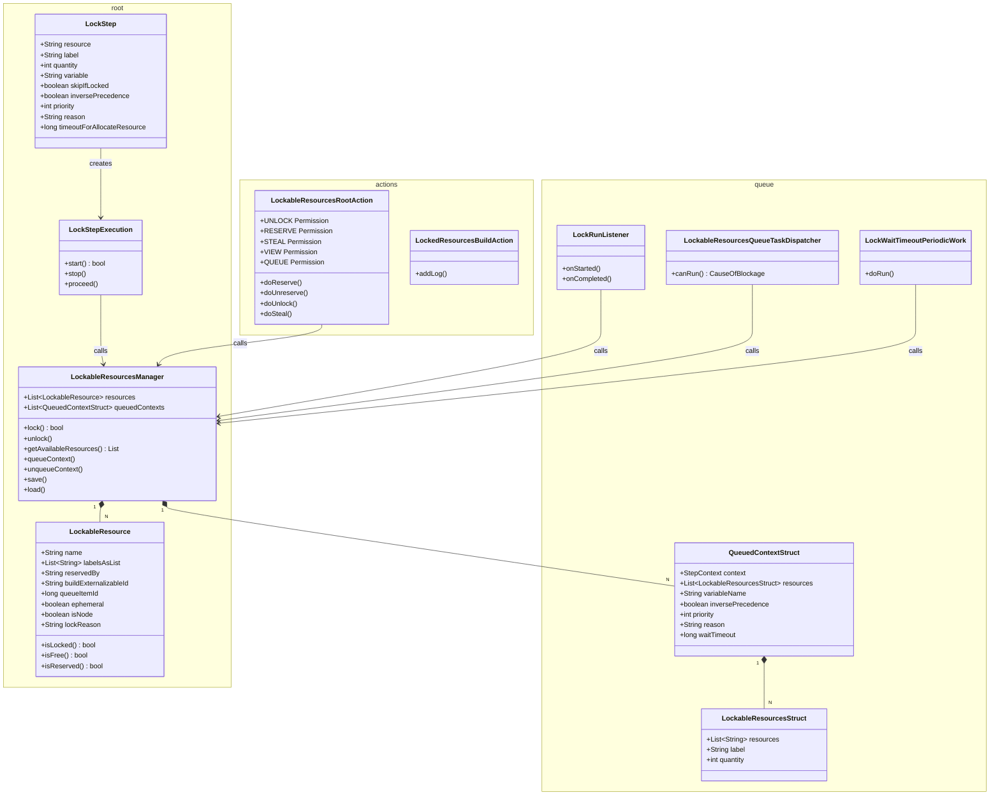

---

## 3. Data Model Details

### 3.1 LockableResource Fields and State

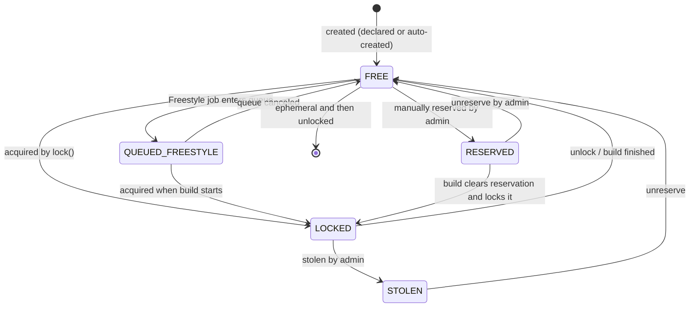

| Field | Type | Meaning |
|---|---|---|
| `name` | `String` | unique resource identifier (immutable) |
| `labelsAsList` | `List<String>` | labels used for grouping |
| `reservedBy` | `String` | username that currently holds a manual reservation |
| `buildExternalizableId` | `String` | ID of the Run currently locking the resource (for persistence) |
| `queueItemId` | `long` | queue item ID while waiting in Freestyle queue |
| `ephemeral` | `boolean` | true = auto-created outside declared config, auto-removed after unlock |
| `isNode` | `transient boolean` | virtual resource mirrored from a Jenkins Node |
| `lockReason` | `String` | reason string provided by the lock step |
| `stolen` | `boolean` | flag indicating the resource was forcefully taken by an admin |

### 3.2 Class Inheritance Relationships

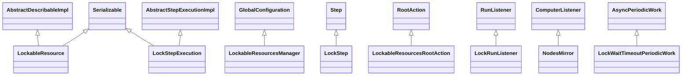

---

## 4. Execution Flow of the Pipeline lock Step

### 4.1 Successful Acquisition Path

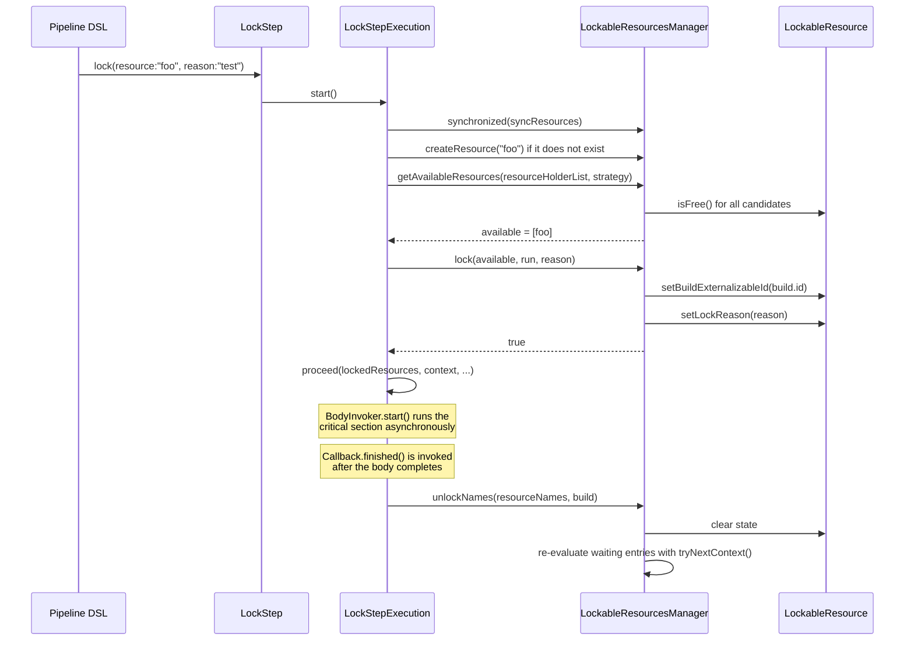

### 4.2 Failure -> Wait -> Retry Path

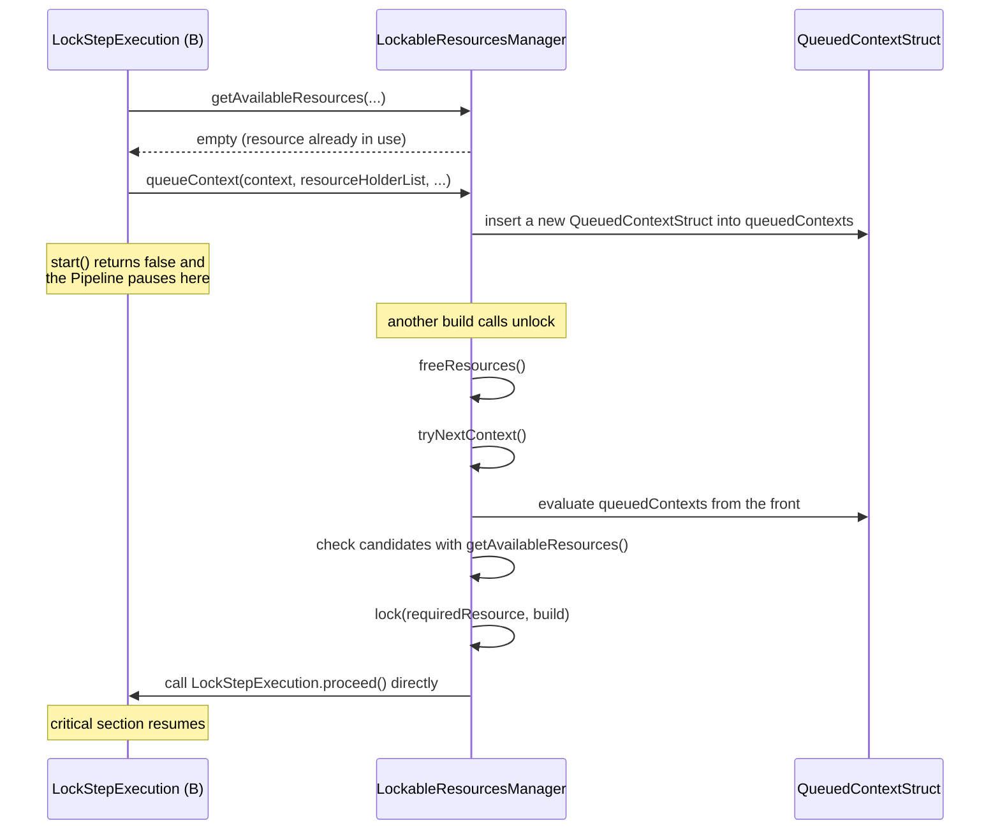

---

## 5. How the Waiting Queue Works

The queue is not a simple FIFO in all cases. It supports priority and inverse precedence while still trying to avoid starvation.

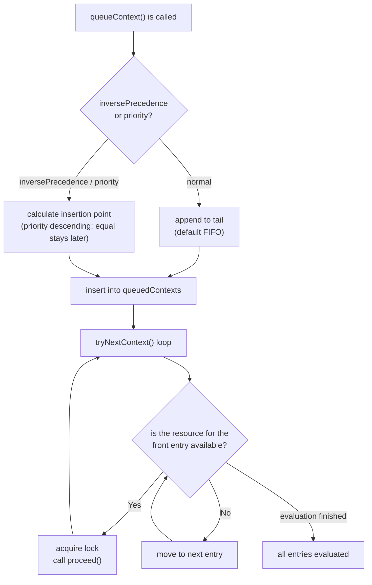

**Timeout handling while waiting (`LockWaitTimeoutPeriodicWork`):**

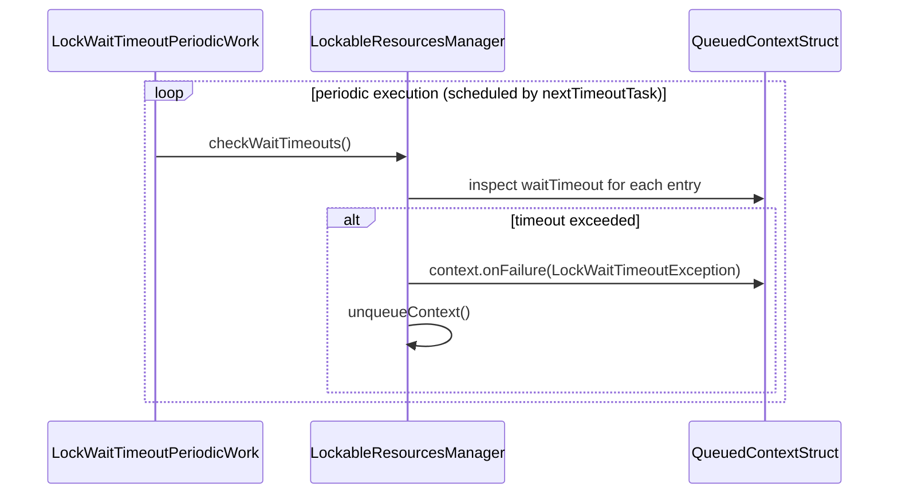

---

## 6. Integration with Freestyle Builds

Freestyle builds rely on the standard Jenkins queue model, instead of the Pipeline pause/resume mechanism.

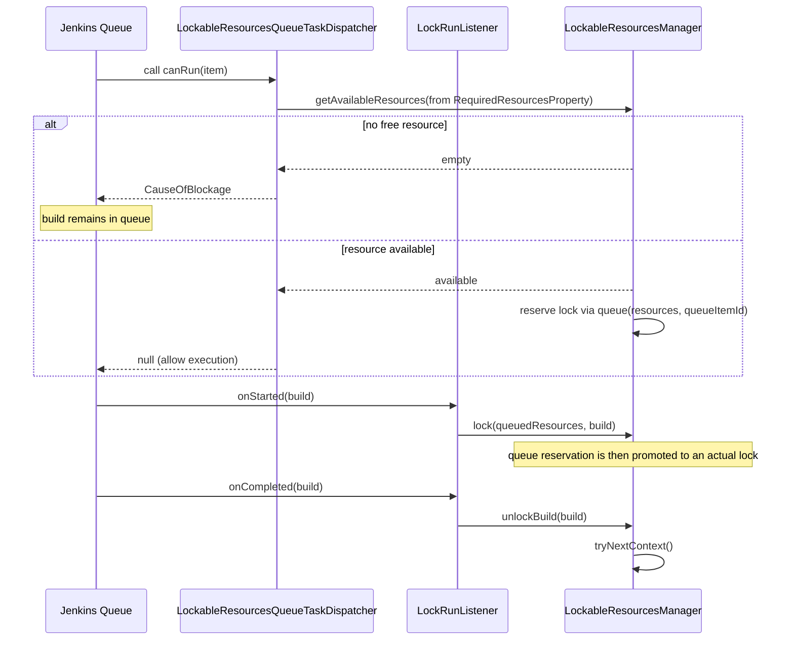

---

## 7. UI and HTTP API

### 7.1 URL Structure

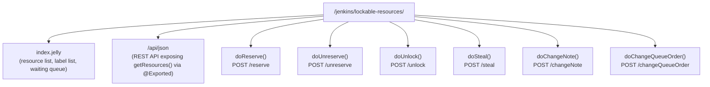

### 7.2 Permission Model

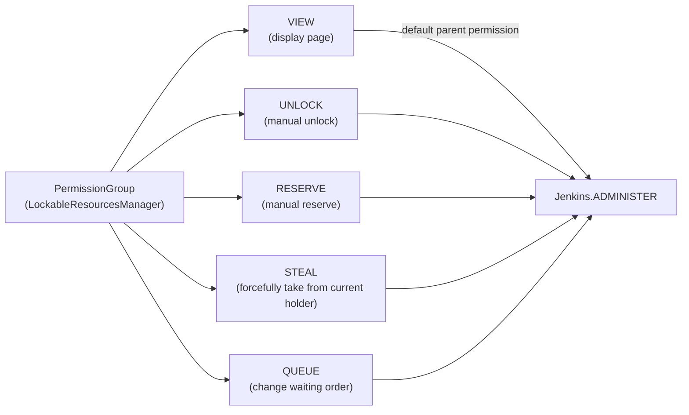

**Important note for potential distributed use:**  
`LockableResourcesRootAction` is implemented as a `RootAction` (authenticated), not an `UnprotectedRootAction`.  
This keeps it inside the standard Jenkins authentication flow.  
If another Jenkins instance calls these endpoints, API token-based authentication is required.

---

## 8. Persistence Mechanism

The plugin persists state through Jenkins `GlobalConfiguration`, with optional asynchronous save coalescing to reduce disk I/O churn.

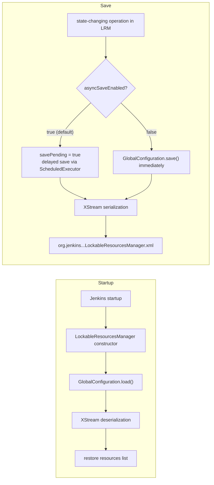

**Asynchronous save design (`saveCoalesceMs`: default `1000ms`):**

To avoid bursts of disk I/O in environments with frequent lock/unlock activity, save operations are coalesced using `AtomicBoolean savePending` and a `ScheduledExecutor`.  
This can be disabled with the system property `org.jenkins.plugins.lockableresources.ASYNC_SAVE=false`.

---

## 9. Nodes Mirror Feature

When enabled, this feature mirrors Jenkins nodes as lockable resources so node-level exclusivity can be modeled through the same lock mechanism.

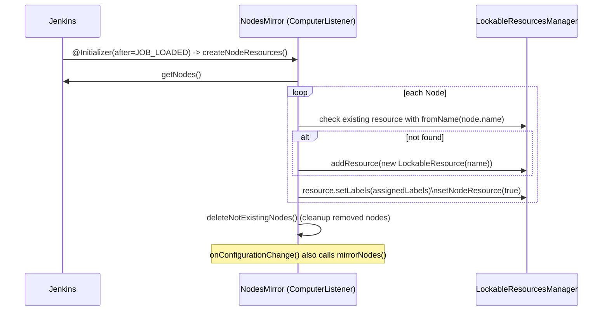

Enabled by: `-Dorg.jenkins.plugins.lockableresources.ENABLE_NODE_MIRROR=true`  
Use case: treat Jenkins agent nodes themselves as lockable resources (for example, exclusive use of a specific node).

---

## 10. Synchronization and Thread-Safety Strategy

Thread safety is centered on a shared monitor (`syncResources`) combined with targeted caches to keep lock checks efficient.

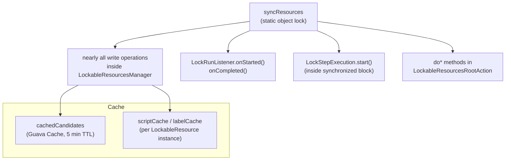

| Target | Strategy |
|---|---|
| Resource list read/write | `synchronized (syncResources)` |
| Candidate resource cache | `Guava Cache` (5 min TTL, keyed by queueItemId) |
| Groovy script result cache | per-resource `ConcurrentHashMap` + TTL (default 30s) |
| Save processing | `AtomicBoolean savePending` + coalescing |

---

> **Note:** This document is based on the master-branch codebase (2.19 line).  
> Main referenced files:  
> - `LockableResource.java`  
> - `LockableResourcesManager.java`  
> - `LockStepExecution.java`  
> - `LockStep.java`  
> - `actions/LockableResourcesRootAction.java`  
> - `queue/LockRunListener.java`  
> - `queue/LockableResourcesQueueTaskDispatcher.java`  
> - `nodes/NodesMirror.java`
