# Lockable Resources Plugin アーキテクチャ解析

対象ブランチ: master  
対象パス: `lockable-resources-plugin/`  
目的: 実装把握 & 分散拡張の設計検討

---

## 目次

1. [全体構造の鳥瞰図](#1-全体構造の鳥瞰図)
2. [パッケージ構成とクラスの責務](#2-パッケージ構成とクラスの責務)
3. [データモデル詳細](#3-データモデル詳細)
4. [Pipeline での lock ステップ実行フロー](#4-pipeline-での-lock-ステップ実行フロー)
5. [待機キューの仕組み](#5-待機キューの仕組み)
6. [Freestyle ビルドとの連携](#6-freestyle-ビルドとの連携)
7. [UI と HTTP API](#7-ui-と-http-api)
8. [永続化の仕組み](#8-永続化の仕組み)
9. [Nodes Mirror 機能](#9-nodes-mirror-機能)
10. [同期・スレッド安全戦略](#10-同期スレッド安全戦略)

---

## 1. 全体構造の鳥瞰図

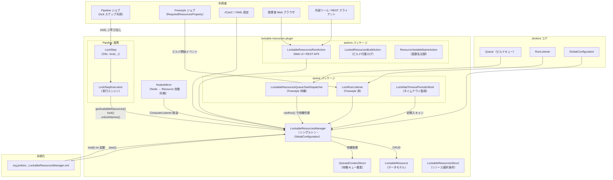

---

## 2. パッケージ構成とクラスの責務

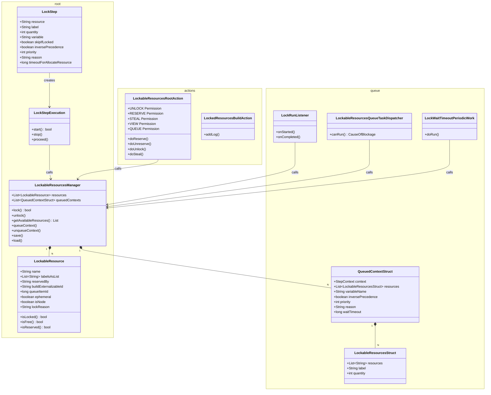

---

## 3. データモデル詳細

### 3.1 LockableResource のフィールドと状態

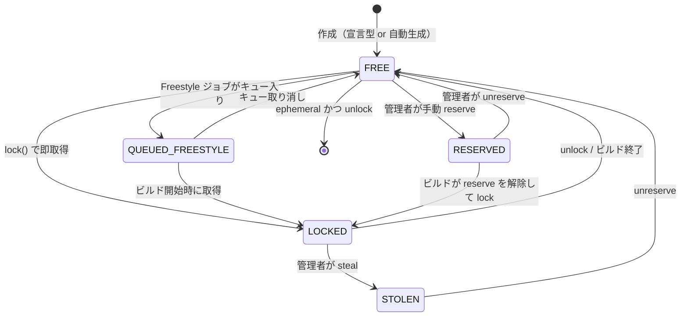

| フィールド | 型 | 意味 |
|---|---|---|
| `name` | `String` | リソースの一意識別子（変更不可）|
| `labelsAsList` | `List<String>` | グループ化用ラベル |
| `reservedBy` | `String` | 手動 reserve 中のユーザー名 |
| `buildExternalizableId` | `String` | ロック中の Run の ID（永続化用）|
| `queueItemId` | `long` | Freestyle キュー待ち中の Item ID |
| `ephemeral` | `boolean` | true = スコープ外 lock 時に自動生成、unlock 時に自動削除 |
| `isNode` | `transient boolean` | Jenkins Node から自動ミラーされた仮想リソース |
| `lockReason` | `String` | lock ステップで指定された理由文字列 |
| `stolen` | `boolean` | 管理者が奪取した場合のフラグ |

### 3.2 クラスの継承関係

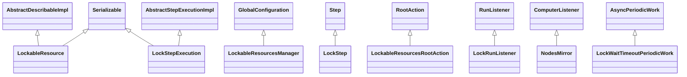

---

## 4. Pipeline での lock ステップ実行フロー

### 4.1 取得成功パス

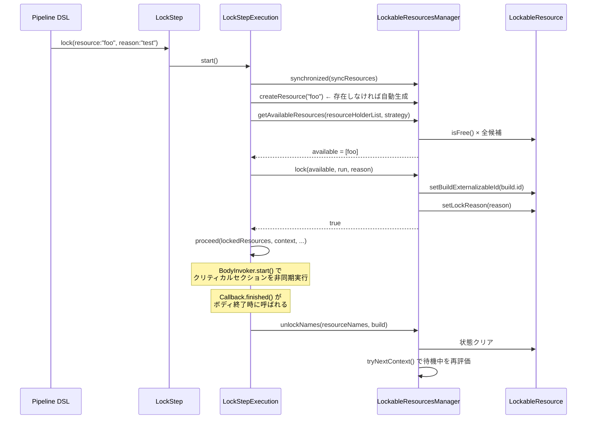

### 4.2 取得失敗→待機→再取得パス

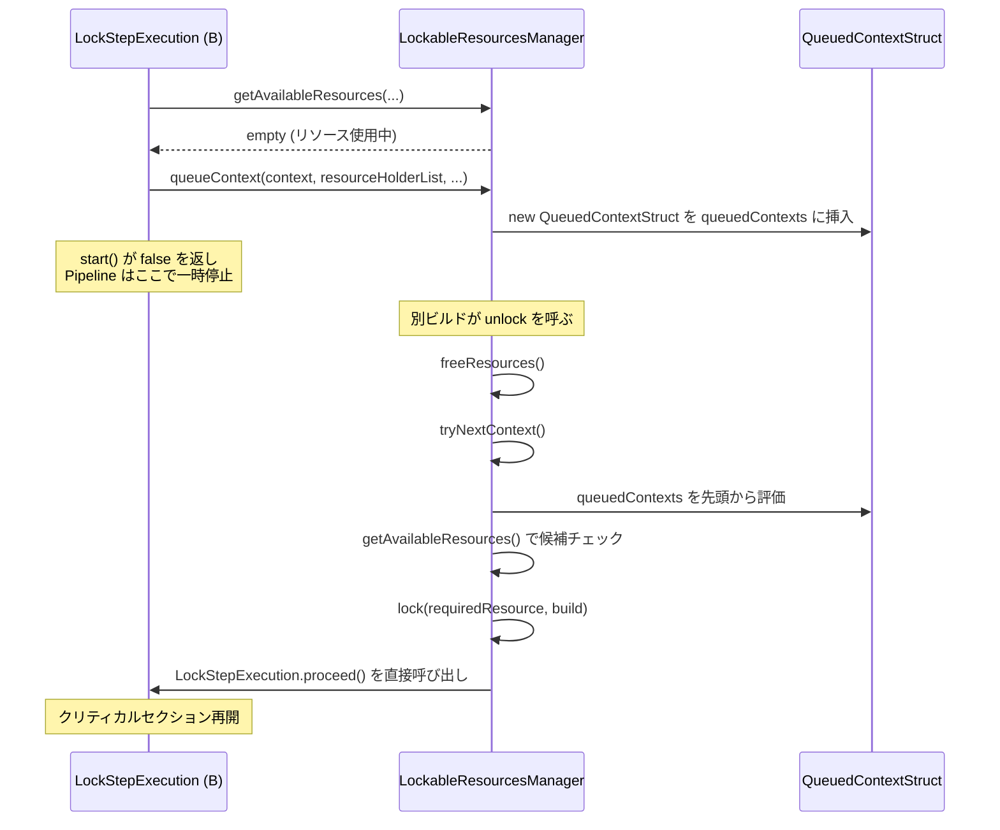

---

## 5. 待機キューの仕組み

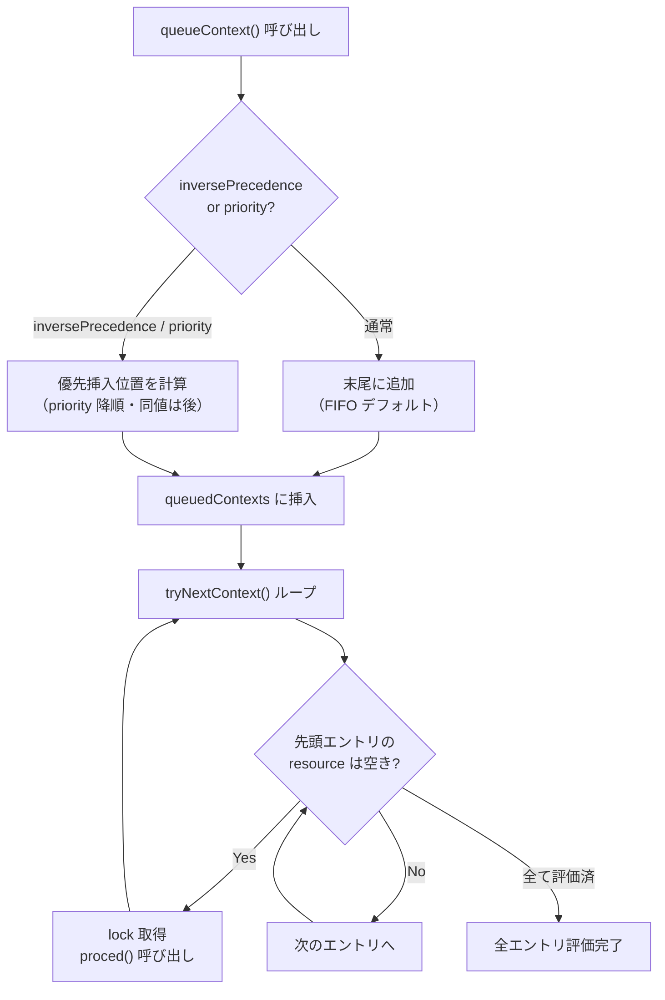

**timeout 付き待機（LockWaitTimeoutPeriodicWork）:**

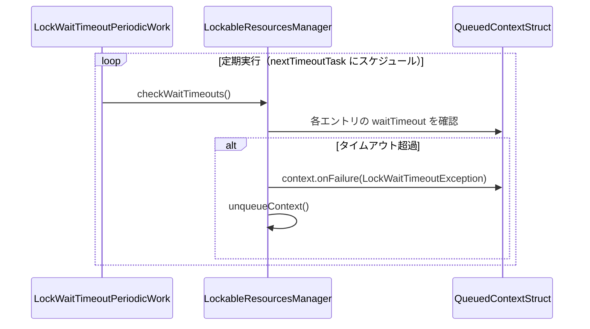

---

## 6. Freestyle ビルドとの連携

Freestyle は Pipeline と異なり、**Jenkins の標準ビルドキュー** を経由してリソース管理を行います。

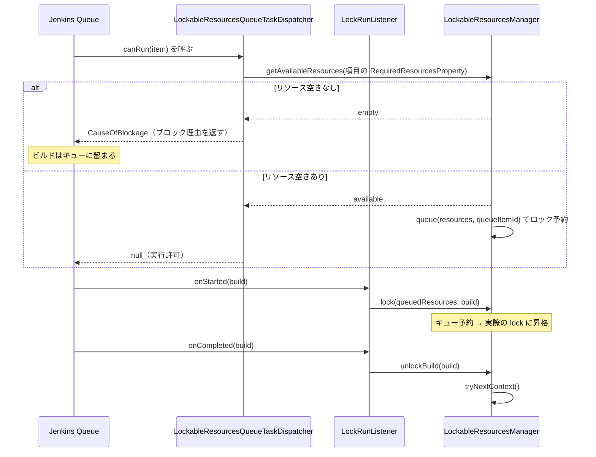

---

## 7. UI と HTTP API

### 7.1 URL 構成

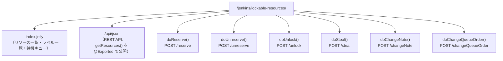

### 7.2 権限モデル

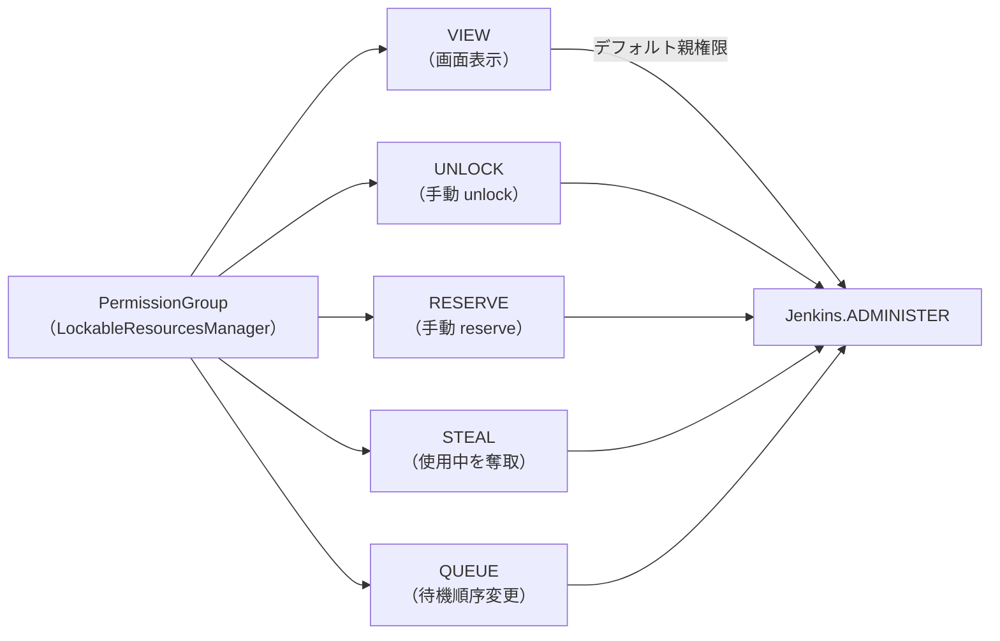

**分散化における注意点:**  
`LockableResourcesRootAction` は `RootAction`（認証済み）として実装されています。  
`UnprotectedRootAction` ではなく、通常の認証フローに乗ります。  
外部 Jenkins からエンドポイントを呼ぶ場合は、Jenkins の API Token 認証ヘッダが必要です。

---

## 8. 永続化の仕組み

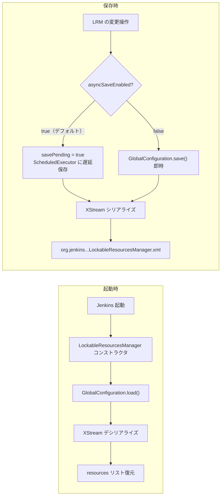

**非同期保存の設計（saveCoalesceMs: デフォルト 1000ms）:**

lock が頻繁に起きる環境でのディスク I/O バーストを防ぐため、`AtomicBoolean savePending` + `ScheduledExecutor` でコアレスされます。  
システムプロパティ `org.jenkins.plugins.lockableresources.ASYNC_SAVE=false` で無効化できます。

---

## 9. Nodes Mirror 機能

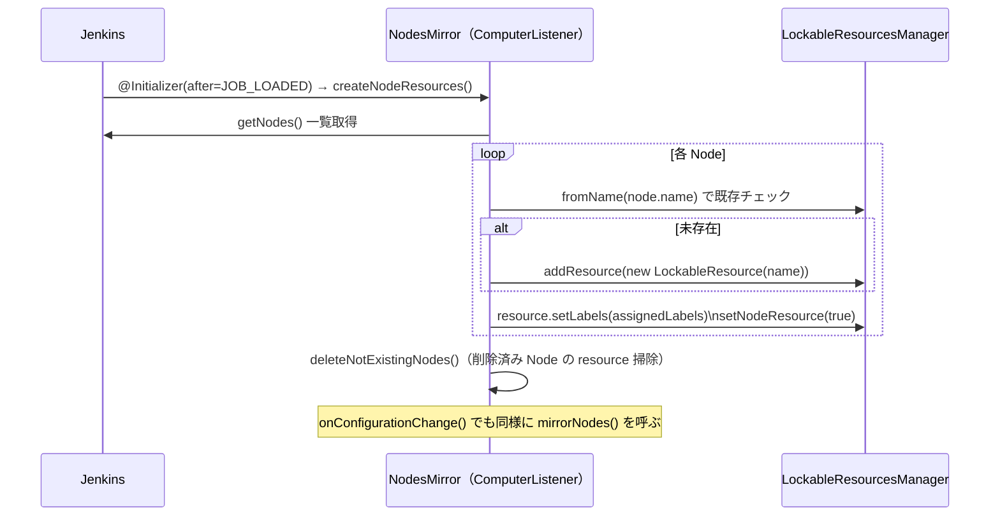

有効化: `-Dorg.jenkins.plugins.lockableresources.ENABLE_NODE_MIRROR=true`  
用途: Jenkins Agent ノード自体を lockable resource として管理する（例: 特定 node の独占使用）

---

## 10. 同期・スレッド安全戦略

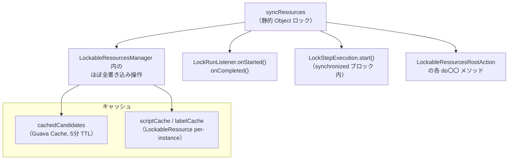

| 対象 | 方針 |
|---|---|
| リソースリスト読み書き | `synchronized (syncResources)` |
| 候補リソースキャッシュ | `Guava Cache`（5分 TTL、queueItemId がキー）|
| Groovy スクリプト結果 | per-resource `ConcurrentHashMap` + TTL（デフォルト 30s）|
| 保存処理 | `AtomicBoolean savePending` + coalesce |

---

> **メモ:** このドキュメントは master ブランチ（2.19 系）のコードを元に作成。  
> 参照ファイル:  
> - `LockableResource.java`  
> - `LockableResourcesManager.java`  
> - `LockStepExecution.java`  
> - `LockStep.java`  
> - `actions/LockableResourcesRootAction.java`  
> - `queue/LockRunListener.java`  
> - `queue/LockableResourcesQueueTaskDispatcher.java`  
> - `nodes/NodesMirror.java`
